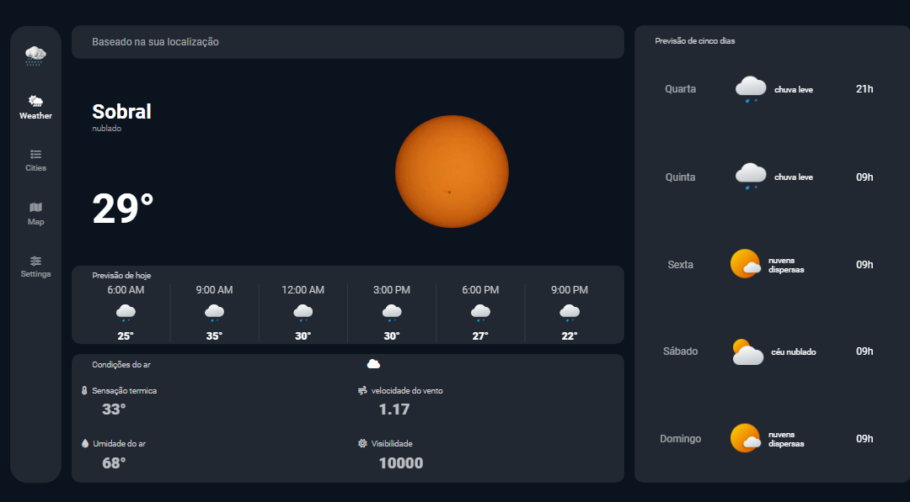
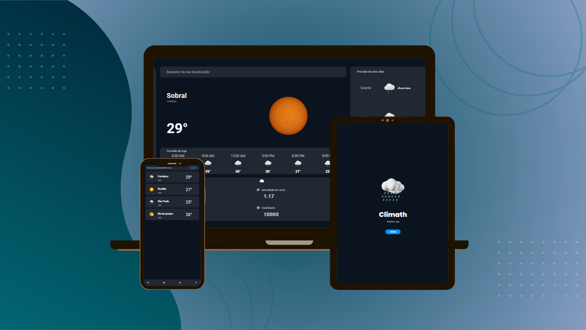
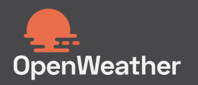
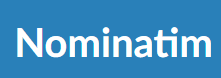
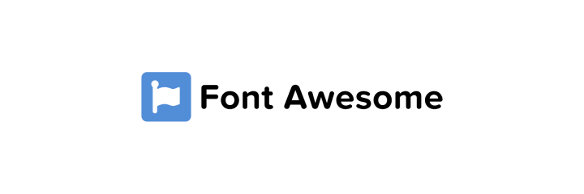

O objetivo principal do projeto é aprimorar minhas habilidades com javaScript. Nesse projeto utilizo duas ferramentas: Nominatim, uma ferramenta de busca de nomes de cidades baseada na latitude e longitude do user, e a OpenWeatherMap é uma plataforma que fornece informações meteorológicas em tempo real e previsões para mais de 200 mil cidades em todo o mundo. A aplicação oferece as seguintes informações:
<ul> 
<li>‣ Previsão do tempo baseado na cidade do usuario.</li>
<li>‣ Sensação térmica.</li>
<li>‣ Umidade do ar</li>
<li>‣ Velocidade do vento</li>
<li>‣ Visibilidade</li>
<li>‣ Previsão metereológica dos próximos cinco dias</li>
<li>‣ Pesquisar a temperatura atual de qualquer cidade</li>
</ul>
A aplicação ainda está em desenvolvimeto, em breve, adicionarei o mapa climático das cidades selecionadas e um painel de configurações ilustrativo.

 

  

 Ferramentas utilizadas:

 

 

Meu linkedin:

  
